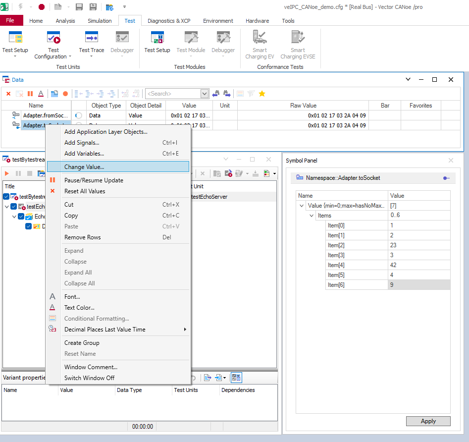

# VeIPC Echo Server Demo

The aim of this demo is to showcase how the SIL Kit Adapter veIPC can be used together with an application that acts as a mockup for the actual MICROSAR Adaptive component for veIPC communication. This mockup provides a TCP socket, the SIL Kit Adapter veIPC can connect to and it receives framed datagrams over this TCP socket connection and echoes the data back.

The communication between the SIL Kit Adapter veIPC and the mockup application happens with framed message protocol (as with the actual MICROSAR Adaptive component). Each message consists of a 2-byte length header followed by the payload data.

There is also an additional SIL Kit participant which generates random messages for this already explained setup.

The echo server listens on TCP port 6666 by default and can be configured for different endianness modes: `little_endian` and `big_endian`.

## Demo Common Steps

Before running any demo, you need to setup the SIL Kit registry:

```
/path/to/SilKit-x.y.z-$platform/SilKit/bin/sil-kit-registry --listen-uri 'silkit://0.0.0.0:8501'
```

## Basic Echo Demo

First launch the echo server, which will listen for incoming socket connections:

```
./bin/sil-kit-demo-veipc-echo-server --endianness little_endian
[Info] Using little_endian for header size
[Info] Server listening on 0.0.0.0:6666
```

> The server always binds to `0.0.0.0:6666`. This is hardcoded and cannot be changed via command line.

Then, launch the adapter in a separate terminal, which connects to the registry (to connect to other participants) and to the echo server to transmit data:

```
./bin/sil-kit-adapter-veipc localhost:6666,toSocket,fromSocket --endianness little_endian
[date time] [SilKitAdapterVeIpc] [info] Creating participant, ParticipantName: SilKitAdapterVeIpc, RegistryUri: silkit://localhost:8501, SilKitVersion: 5.0.1
[date time] [SilKitAdapterVeIpc] [info] Connected to registry at 'tcp://127.0.0.1:8501' via 'tcp://127.0.0.1:47356' (local:///tmp/SilKitRegi1c2f6436cf7eedb.silkit, tcp://localhost:8501)
[date time] [SilKitAdapterVeIpc] [info] Socket connection successfully established
Press CTRL + C to stop the process...
```

You should see the echo server accepting the connection:

```
[Info] Client connected
```

### Automatic Sender Demo Participant

The `sil-kit-demo-veipc-auto-sender` application is a SIL Kit participant that automatically sends random payloads through the `toSocket` topic and receives echoed data on the `fromSocket` topic. You can run it as follows:

```
   ./bin/sil-kit-demo-veipc-auto-sender --payload-size 8
   [date time] [VeIpcAutoSender] [info] Creating participant, ParticipantName: VeIpcAutoSender, RegistryUri: silkit://localhost:8501
   [date time] [VeIpcAutoSender] [info] Payload size set to 8 bytes
   [date time] [VeIpcAutoSender] [info] Starting to send random 8-byte payloads every 2 seconds...
   [date time] [VeIpcAutoSender] [info] Press CTRL + C to stop the process...
   [date time] [VeIpcAutoSender] [info] AutoSender >> Adapter: a3 7f 2c 91 45 bb 0e 12
   [date time] [VeIpcAutoSender] [info] Adapter >> AutoSender: a3 7f 2c 91 45 bb 0e 12
   [date time] [VeIpcAutoSender] [info] AutoSender >> Adapter: 5d c2 89 04 f1 3a 6e 77
   [date time] [VeIpcAutoSender] [info] Adapter >> AutoSender: 5d c2 89 04 f1 3a 6e 77
   ...
```
> The --payload-size argument is optional. When omitted, the sender will automatically generate random payloads starting at 1 byte and incrementing by 1 byte every two seconds until 10 bytes, then restarting at 1 byte.
> The topics are hardcoded to `toSocket` (publish) and `fromSocket` (subscribe).

In the following diagram you can see the whole setup. It illustrates the data flow going through each component involved.
```
                          +------------------+--------------------------+
                          | Payload Length   |     Payload Data         |
                          |     (2 bytes)    |    (variable size)       |
                          +------------------+--------------------------+
                                                   \
                                                    \  
    +--[ VeIpcEchoServer ]--+--[Socket]--+           )            +--[ SIL Kit Adapter veIPC ]--+
    |                       |  < 6666 >  |< -------------------- >|                             |          
    +-----------------------+------------+                        +-----------------------------+       
                                                                                ^
                                                                                | _          +--------------------+
                                                                                |  \ _______ |    Payload Data    |
                                           SIL Kit topics:                      |            |   (variable size)  |
                                                                                |            +--------------------+                  
    +--[ VeIpcAutoSender ]--+               > toSocket >                        v                      
    |                       |----        ------------------       +-----[ SIL Kit Registry ]-----+                                   
    +-----------------------+    |      /                  \      |                              |                                                      
                                 |------                    ------|                              |           
    +----[ Vector CANoe ]---+    |      \                  /      |                              |
    |                       |----        ------------------       |                              |
    +-----------------------+             < fromSocket <          +------------------------------+
```

## Adding CANoe (19 SP3 or newer) as a participant
Before you can connect CANoe to the SIL Kit network you should adapt the ``RegistryUri`` in ``./demos/SilKitConfig_CANoe.silkit.yaml`` to the IP address of your system where your sil-kit-registry is running.

### CANoe Desktop Edition
Load the ``veIPC_CANoe_demo.cfg`` from the ``./demos/CANoe`` directory. After starting the demo, the current payload appears in the *Data Window*. Then you can see the payload being updated in this *Data Window*, and you can send data to the socket through the *Symbol Panel*:


Before doing this it makes sense to stop the *AutoSender* application first. Optionally you can also start the test unit execution of included test configuration. While the demo server is running the test should be successful. It sends some bytes through the *toSocket* topic, then receives them on the *fromSocket* one.

## Using the SIL Kit Dashboard

For general instructions and features, see the documentation in [common/demos/README.md](https://github.com/vectorgrp/sil-kit-adapters-common/blob/main/docs/sil-kit-dashboard/README.md).

### Steps for the Demo

1. Start the SIL Kit registry with dashboard support:
    ```
    /path/to/SilKit-x.y.z-$platform/SilKit/bin/sil-kit-registry --listen-uri 'silkit://0.0.0.0:8501' --dashboard-uri http://localhost:8082
    ```

2. Launch the veIPC adapter and demo participants as described above.

    > With SIL Kit Dashboard version 1.1.0 or newer, you can configure the participant configuration file to enable all available metrics. See the [SIL Kit documentation](https://github.com/vectorgrp/sil-kit/blob/main/docs/troubleshooting/advanced.rst) for details.

3. Open your web browser and navigate to [http://localhost:8080/dashboard](http://localhost:8080/dashboard).

4. In the dashboard, select the registry URI (e.g., `silkit://localhost:8501`).

5. In the participant tab, you should see `SilKitAdapterVeIpc`, `VeIpcAutoSender`, and any other participants (such as CANoe).

6. Click on `SilKitAdapterVeIpc` and look under `Data / RPC Services` to find the Data Publisher/Subscriber with the topic names `fromSocket` and `toSocket` and their labels.

7. Use the dashboard to monitor participant status and troubleshoot issues specific to the demo.
